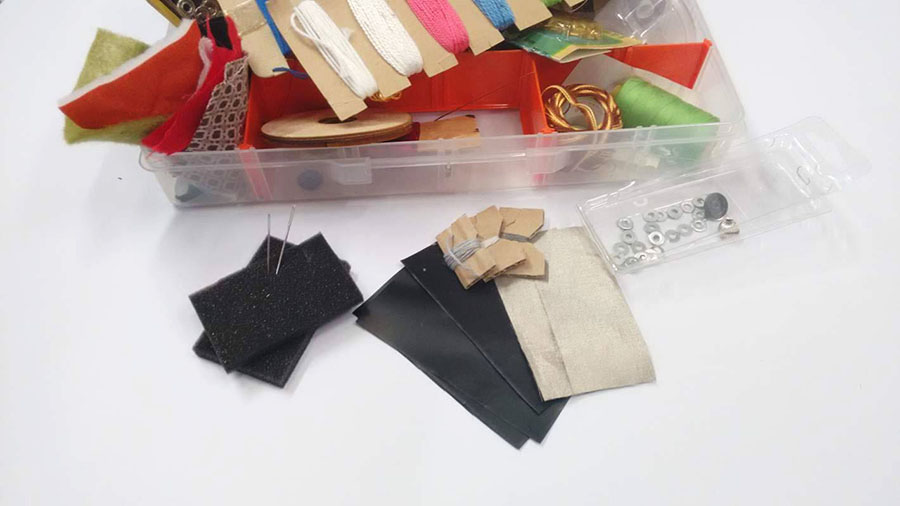
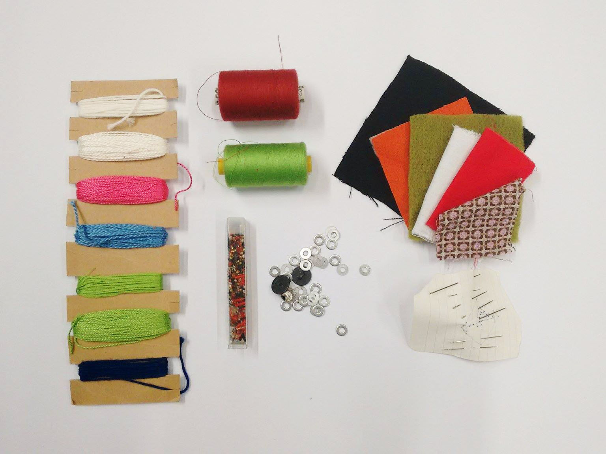
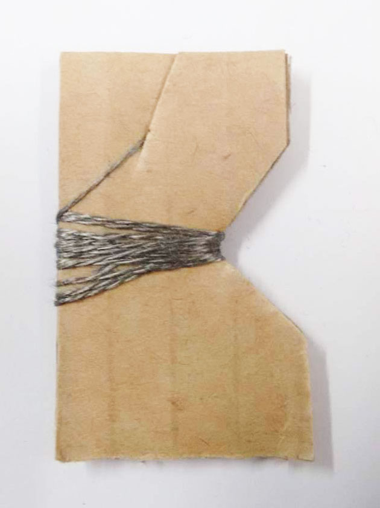
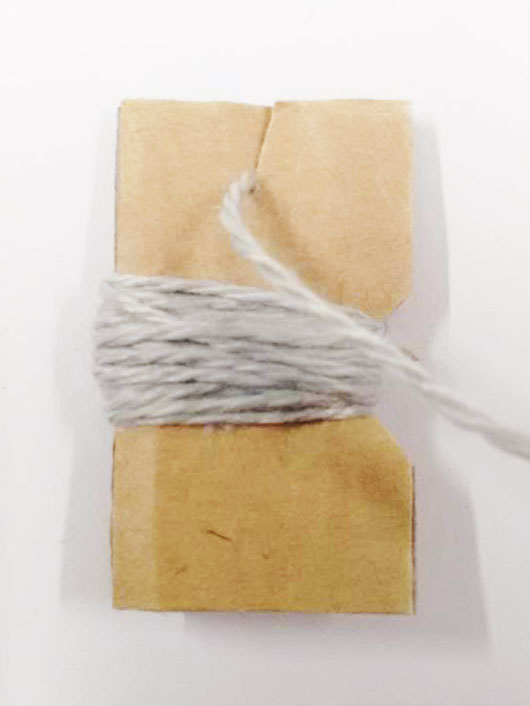
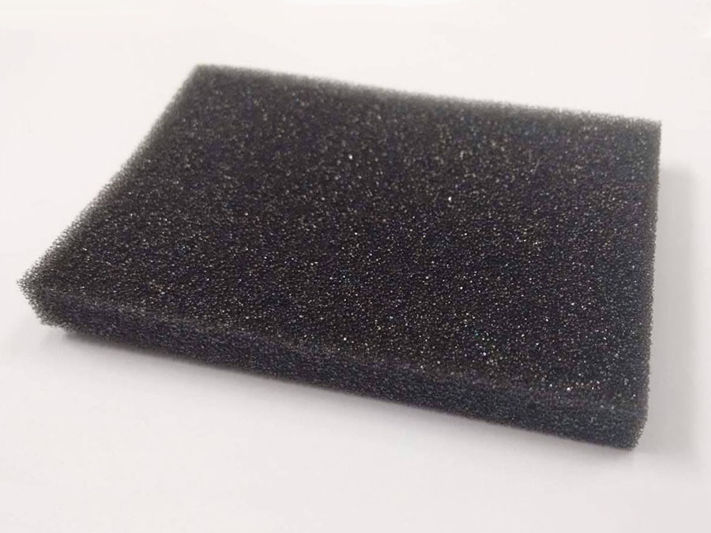
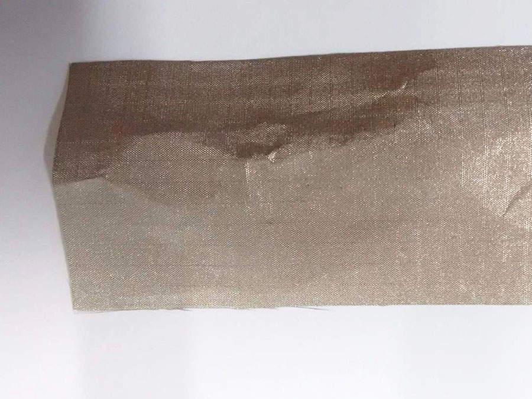
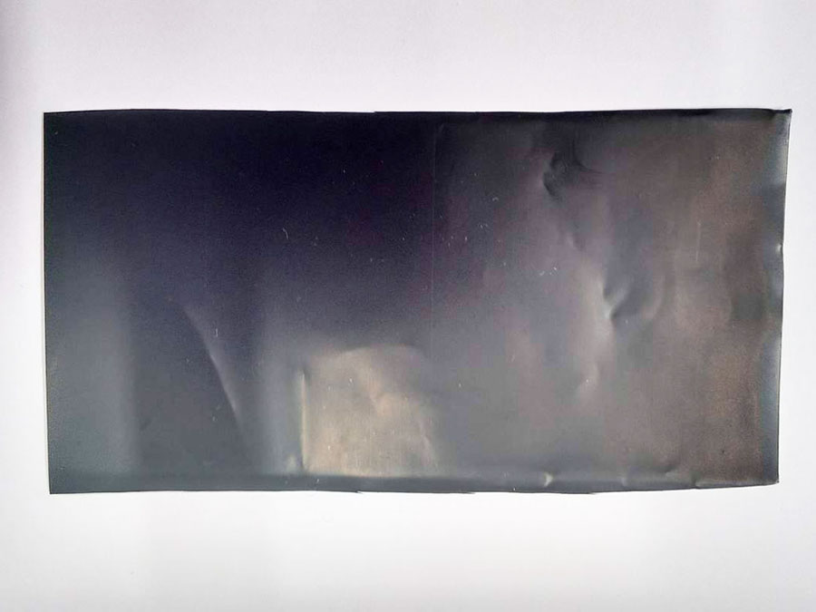

# Soft Sensors

  
  
## The Basic Kit  
  
  
### Sewing supplies
Assorted Fabrics and threads, wool, needles, beads, conductive beads.

Sewing supplies avalible from your nearest sewing shop.
  
### Conductive Thread  
Thread spun from stainless steel.

[conductive thread](http://www.mindkits.co.nz/store/p/8723-Conductive-Thread-60g-Stainless-Steel.aspx)
  
### Conductive Wool  
Wool spun with stainless steel in it.

  
### Foam

  
### Conductive Ripstop
Conductive fabric woven with stainless steel.

[Conductive Rip-stock](http://www.mindkits.co.nz/store/p/8814-Conductive-Fabric-12-inches-x13inches-Ripstop.aspx)
  
### Velostat
Made from polymeric foil with carbon black, Velostat is a conductive material that reduces in resistance when pressure is applied. 

### Stranded Wire
[Standed Wire](http://www.mindkits.co.nz/store/p/8861-Hook-Up-Wire-Assortment-Stranded.aspx)

### Sewable LED
[LilyPad LED](http://www.mindkits.co.nz/lilypad-led-yellow-5pcs.aspx)

### Coin Battery
[3V Battery](http://www.mindkits.co.nz/store/p/9127-Coin-Cell-Battery-20mm.aspx)
