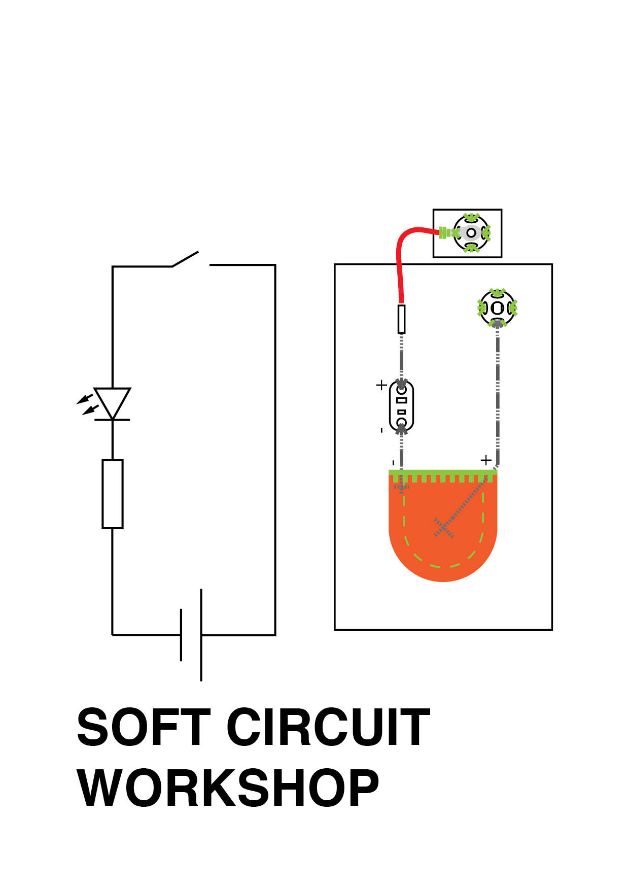
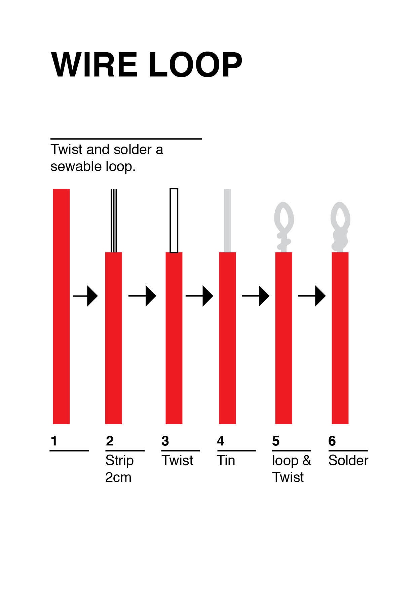

## Basic Soft Circiut
This Circiut from a workshop I developed at Fab Lab Wellington is a good way to practice basic soft circuit techniques.
  

  
  
## Common Stitches
  

  
### useful links
[Backstitch Tutorial](https://www.youtube.com/watch?v=rZ_wVC84UmM&feature=youtu.be)  
[Running Stitch Tutorial](https://www.youtube.com/watch?v=W4nhj8kMpAI&feature=youtu.be)  
[Couching Tutorial](https://www.youtube.com/watch?v=4X4LC8FGAsM&feature=youtu.be)  
[Buttonhole/ Blanket Stitch Tutorial](https://www.youtube.com/watch?v=Wcf9iJHST94&feature=youtu.be)  
  
  
## Joining Conductive Thread
  

  
  
## Hard Component's
  

  
  
## Soldering
  

  
### useful links
[Soldering Basics](https://www.youtube.com/watch?v=KMKoHI4yFN8)
  
  
## Sewing on Wires
  

  
  
## Switches
  

  
  
## Battery Cover
  

  
### useful links
[Original Design](http://www.kobakant.at/DIY/?p=4432)
