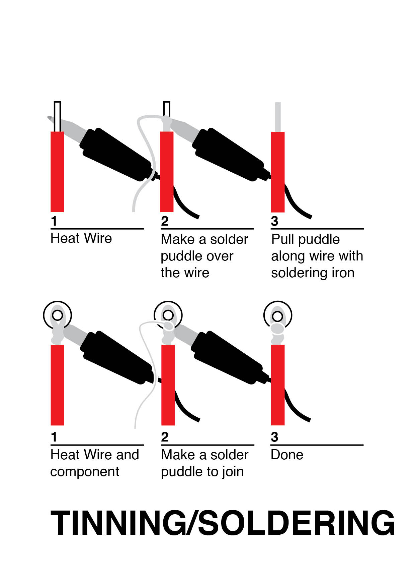
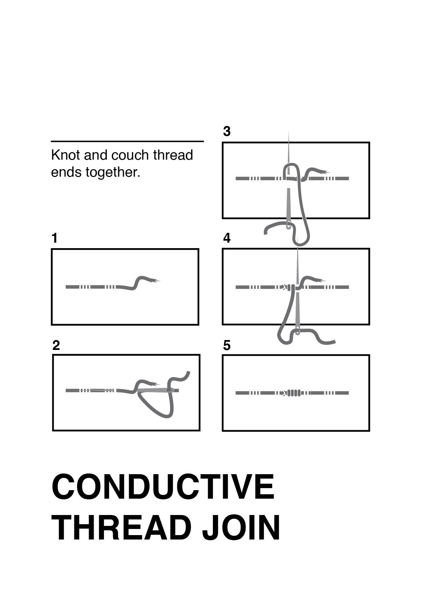
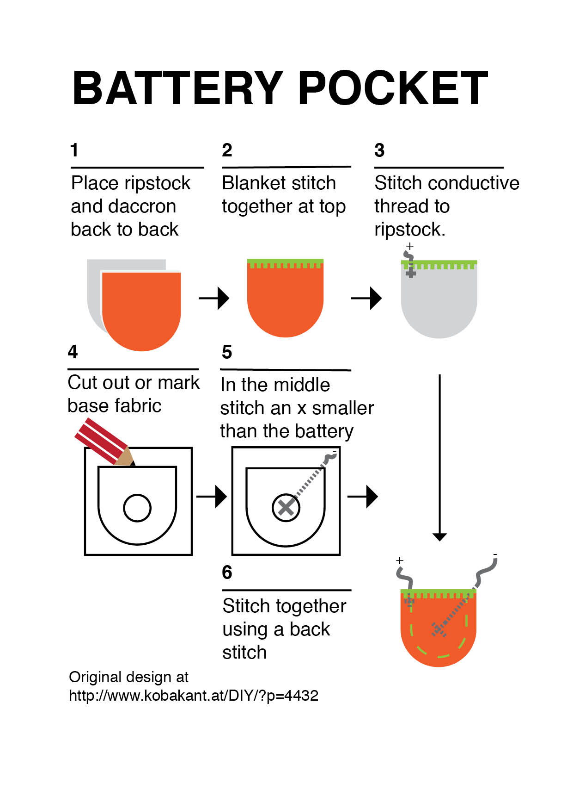

## Common Stitches

### useful links
[Backstitch Tutorial](https://www.youtube.com/watch?v=rZ_wVC84UmM&feature=youtu.be)  
[Running Stitch Tutorial](https://www.youtube.com/watch?v=W4nhj8kMpAI&feature=youtu.be)  
[Couching Tutorial](https://www.youtube.com/watch?v=4X4LC8FGAsM&feature=youtu.be)  
[Buttonhole/ Blanket Stitch Tutorial](https://www.youtube.com/watch?v=Wcf9iJHST94&feature=youtu.be)  
  
  
## Wire
  

  
  
## Hard Component's

  
  
## Temporary connections
  

  
  
## Joining Conductive Thread
  

  
  
## Switches
  

  
  
## Battery Cover

  

