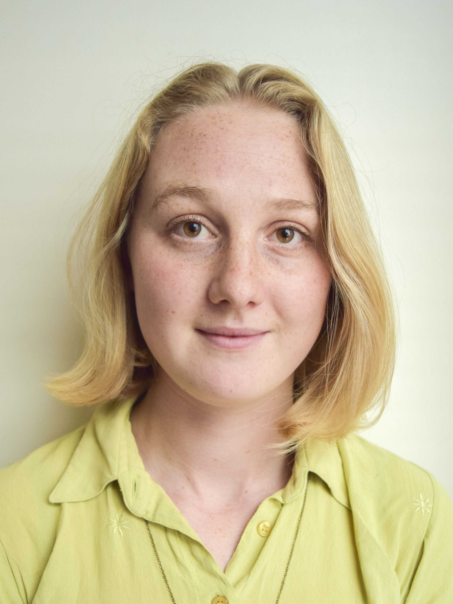
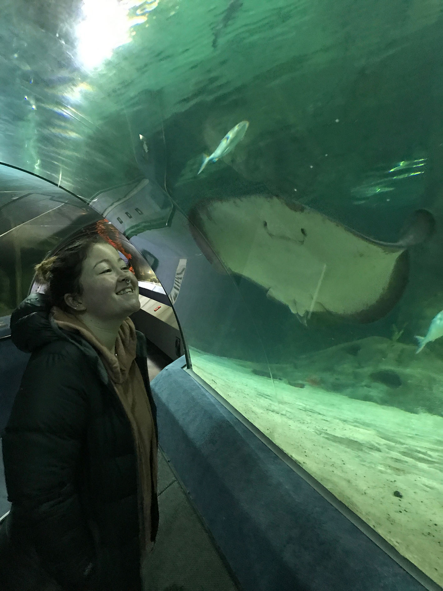
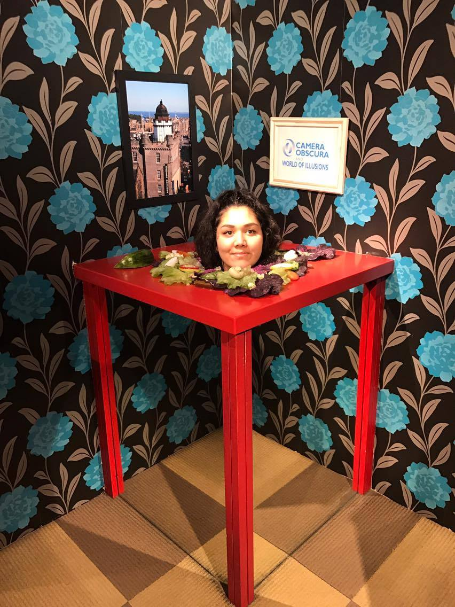

## About us

### Eleanor
I am currently studying full time at Massey University Wellington where I am in my third year of industrial design. My particular areas of interest are in sustainability and user centered design.
Alongside my academic work I am also an avid cyclist and cycle instuctor. 

### Tegan
Kia Ora. 

As a third-year industrial designer at Massey University I'm working towards a future in the industry contributing to the health and quality of life for people. I currently work in the cosmetics and hospitality industry. I'm super excited in areas of bio materials and innovative ways of working with the issue of sustainability.

Buckle up, we're going on a journey.

 
### Kimi
Kia Ora Koutou

My name is Kimi Whiting and I am currently a full time student at Massey University studying Industrial Design. I have recently come back from an exchange abroad in Scotland and am back and ready to rumble. At the moment my areas of interest are user design, exhibition design, and interactive design.
In my spare time I do a lot of painting, drawing and cooking. However my interests change from week to week so you'll find I do a bit of everything.

