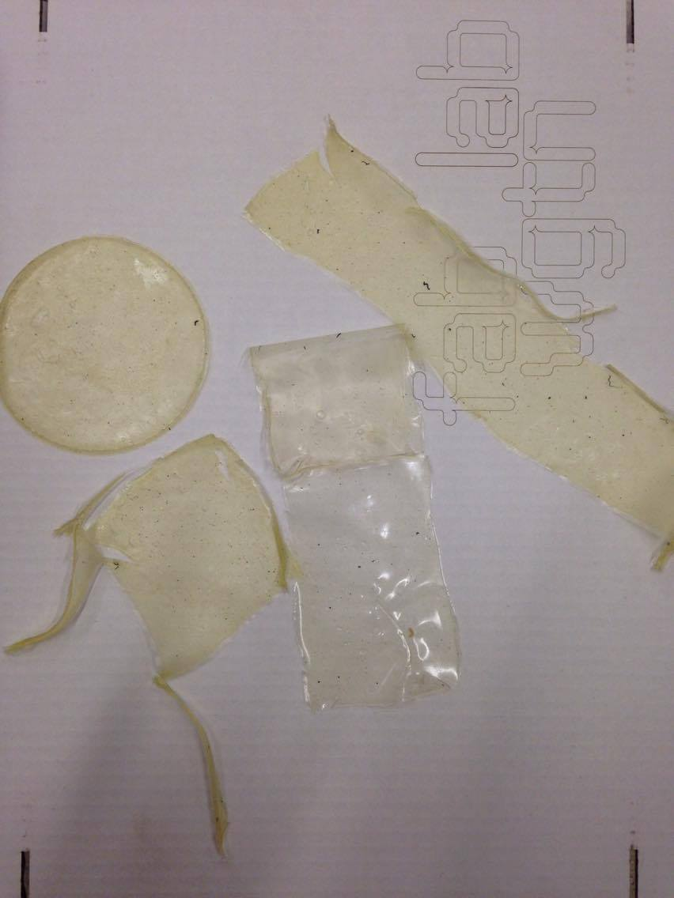

## Recipes

***

### Cornflour and Agar Test ( half was used with guar gum)

25ml glycerol

100ml vinegar

600 ml water

45.5 grams cornflour

5 grams agar

Method : dissolve 300ml of cold water with sieved cornflour, then dissolve the agar in 300ml of hot water, combine. Add all other ingredients ( half of our recipe we put guar gum in, 3 grams in total)into and put it on the stove on a medium to high heat, stir continuisely. Once boiled , keep on stove for 10mins then pour into molds.

***

### Custard Recipe Test (Using left over ingredients)

25mL Glycerol

100mL Vinegar (white)

600mL Water

5 grams Agar

45.5 grams Custard Powder

Method: use 400ml of water and pour into a pot, add agar, vinegar,glycerol. Put on the  medium to high heat and wait till it overflows with lots of bubbles do this for about 10mins.Now dissolve custard powder in cold water (200ml) add to the pot. Simmer until combined and has started to boil then pour into molds. Let them dry naturally for a day then put into oven on low (about 20 degrees) and let it dry.

NOTE: 
-We recommend you dissolve the agar ( in hot water)and custard powder (in cold water) seperately before combining together and with the rest of the ingredients.

-Also because it is custard powder it will have a weird yellow tinge. Super weird looking and not that appealing. We are lookin at just taking away the custard powder option and just sticking with cornflour.

^ final result for custard actual turned out really well. Dosen't stick together and dosen't break when touched.

***

### 3rd Recipe Test (Altered Corn recipe from analysis of first two recipes):

600mL WATER

100mL vinegar (white)

25mL glycerol 100% BP (decrese due to reading online about recipe calling for 1% solution of glycerol)

97g cornflour

***

### Mix 1 - 22:1 ratio

220 grams biosplastic mix

10 grams plywood shaving from the shopbot

NOTE:
-Might have worked better if we had soaked the wood prior.This recipe cracked a lot and became very delicate.

***

### Mix 2 - 111:9 ratio

555 grams bioplastic mix

45 grams plywood shaving from the shopbot

NOTE:
-A lot stronger,however is more of a wood composite then a bio plastic. Our best sample for this one was when we clamped two halves together then let dry in oven then about a day later opened it and let it dry with one side off ( in the oven on low for 2days, flipping mid way to dry evenly) this process made it keep form better and dry flat.

***

### Mix 3 - 22:3 ratio

22 grams bioplastic mix

3 grams wax shavings from CNC mill

Method: Make a bioplastic mix and add your wax shavings, pour into a mold. Will dry within 1-2 days at about 20 degrees in a oven.

NOTE:
-Super weird material, not worth trialing as it did'nt show that much potential. Just made the wax shavings stick together.

***

### 2nd Recipe Test (Corn recipe):

700mL water

100mL vinegar (white)

50mL glycerol 100% BP

97 g Cornflour

NOTE: 
-Some pieces harden quicker then others. Still hasn't completely dried. More potential in testing this recipe than the first. With some tweaking it could potentially become a lot more workable.

***

### 1st recipe test (Agar recipe):

240 ml of cold water

2 Tbsp agar flakes

14g glycerol 100% BP

NOTE: 
-Is a very wet mixture and did'nt dry properly.Broke easily. In this recipe we did use alot of agar so the mixture became very soft.

***

