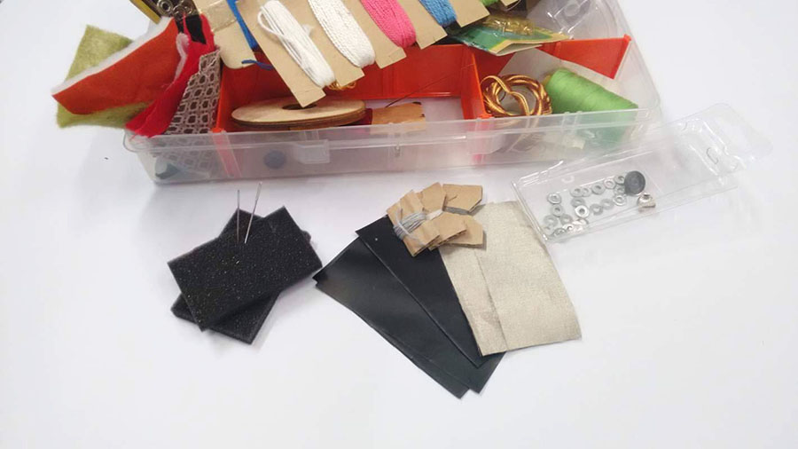
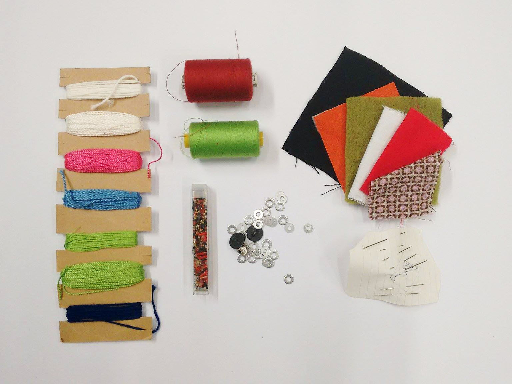
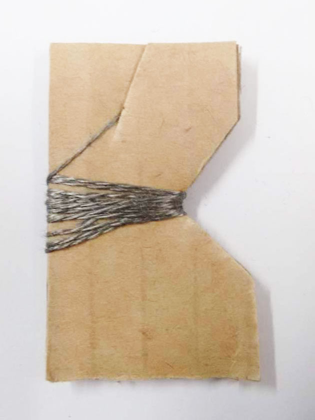
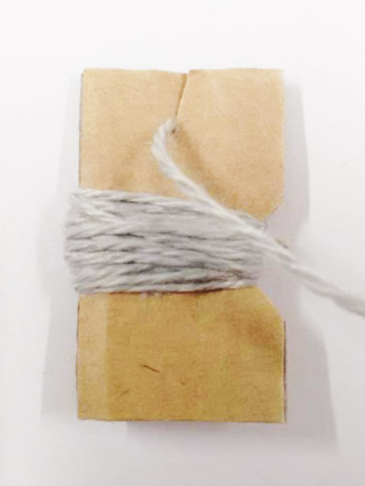
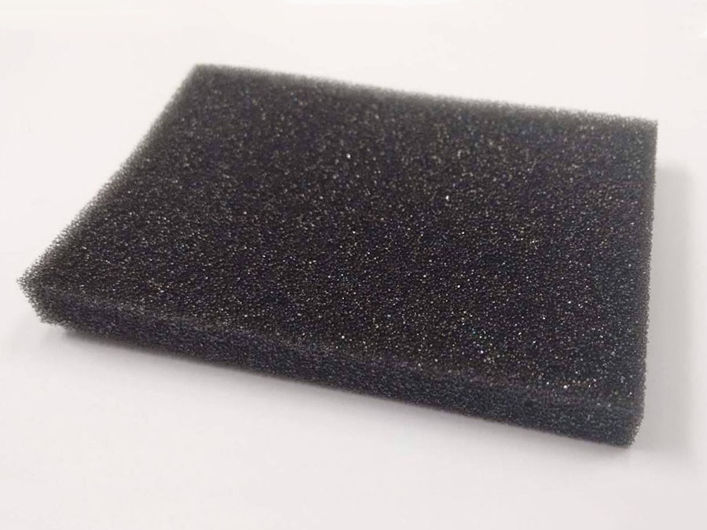
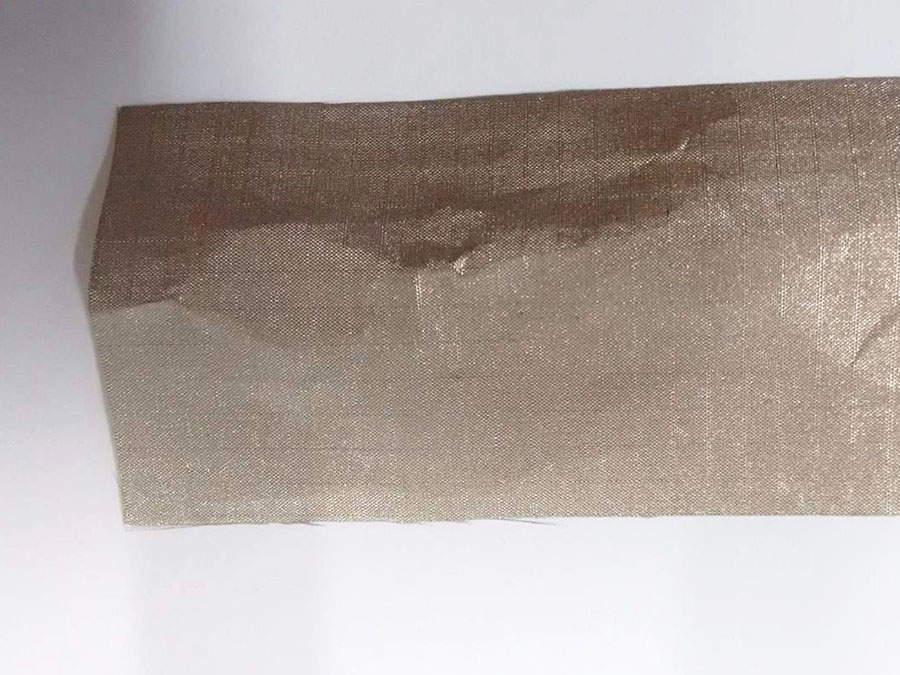
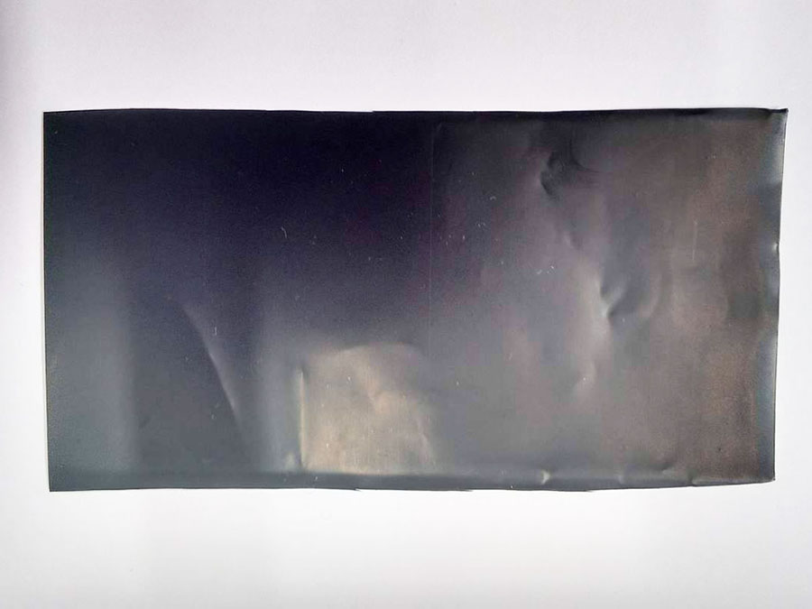

# Soft Sensors

  
  
## The Basic Kit  
  
  
### Sewing supplies
Assorted Fabrics and threads, wool, needles, beads, conductive beads.

  
### Conductive Thread  
Thread spun from stainless steel.

  
### Conductive Wool  
Wool spun with stainless steel in it.

  
### Foam

  
### Ripstop
Conductive fabric woven with stainless steel.

  
### Velostat
Made from polymeric foil with carbon black, Velostat is a conductive material that reduces in resistance when pressure is applied. 

  
***

