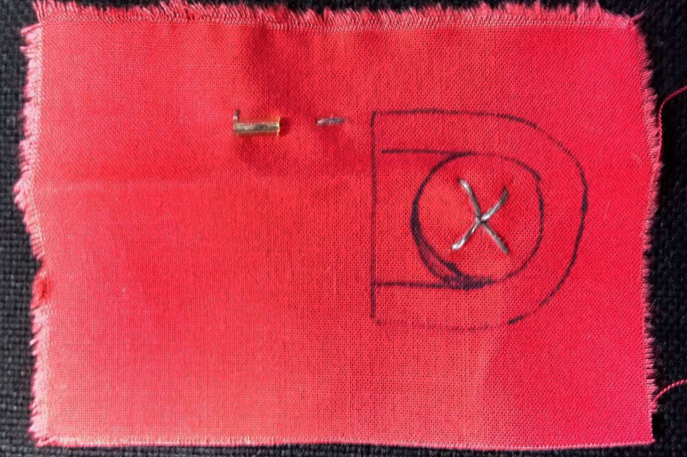
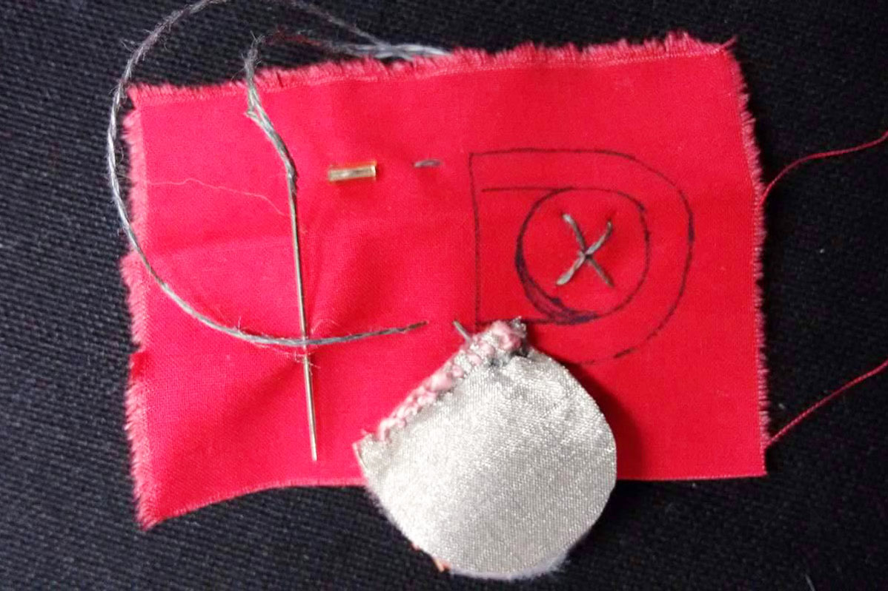

## Common Stitches
### Running Stitch
### Back Stitch
### Blanket Stitch
  
  
## Wire
soldering wires into sewable loops.
  
  
## Hard Component's
Attaching a hard component using conductive thread.
  
  
## Temporary connections
Temporary connections between wire and conductive thread using tube beads.
  
  
## Joining Conductive Thread
Joining conductive thread using couching techniques
  
  
## Switches
### Hook and Eye's
### Domes
### Velcro
  
  
## Battery Cover
Battery cover for coin battery
  
Draw the outline of the cover and where the battery sits on the base fabric

  
Cut out 1 of backed Dacron fabric and 1 of conductive rip-stock. Stitch together at tops with a blanket stitch. This is the positive terminal.

  
Stitch an X in the middle of the marked area for the battery with conductive thread, being sure to keep well within the line. This is negative terminal. Run the thread behind the battery cover and stitch on a tube bead.

  
Run a few stitches into the positive terminal and run a stitch into the opposite side of the cover from the negative terminal thread.

  
Use a non-conductive thread to backstitch the positive and negitive terminals together. sew on other components and insert battery. 

